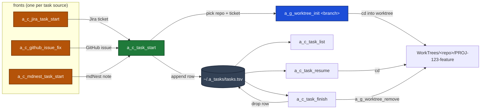

# Task workflow (`a_c_task_*`)

A thin, ticket-aware layer on top of this repo's worktree helpers. One
command starts a task (pick repo -> name a branch from a Jira ticket -> make a
worktree), the rest let you list, resume, and finish tasks across every repo.



## Commands

| Command | What it does |
|---|---|
| `a_c_task_start [-r repo] [-t ticket] [-f feature] [-b base] [-c] [-p prompt] [-z session] [-y] [-- claude args]` | Pick a repo (the repo you're currently in is pinned first as `current =>`, then the most-recently-worked-in repos under `cd_w` ranked by last commit; or a name / full path), turn a Jira ticket into a branch `PROJ-123-feature-name`, create a worktree via `a_g_worktree_init`, cd in, and register the task. `-b` forks from that base branch (e.g. `main` or `story/PROJ-123-foo`) and skips `a_g_worktree_init`'s base picker; omit it to be prompted. Before creating anything it asks `Proceed? [Y/n]`; `-y` (or a non-interactive run) skips that (see "Confirmation & auto mode"). With `-r -t -f -b -y` set it runs with no prompts at all. `-c` then launches a Remote-Control Claude session in the new worktree (see below). `-z` opens the worktree in a named zellij session/tab instead of the current terminal (see below). |
| `a_c_task_resume [ticket\|branch]` | Jump back into an active task's worktree. No argument -> numbered menu with live dirty / ahead-behind state. |
| `a_c_task_list` | Read-only table of all active tasks and their worktree state. |
| `a_c_task_finish [ticket\|branch] [-v] [-f] [--keep-remote]` | Remove the worktree + branch via `a_g_worktree_remove` and drop the task from the registry. Flags pass straight through (`-v` verifies merged first). |

## Task sources: the "front" scripts

`a_c_task_start` is the generic engine (worktree + registry + launch Claude). On
top of it sit thin **fronts**, one per task source. Each one fetches from its own
source, then calls the same engine, so everything downstream (worktree, zellij,
permission posture, idempotency) behaves identically no matter where the task
came from. Each front is fully non-interactive and starts Claude for you.

| Front | Takes | Needs `-r`? |
|---|---|---|
| `a_c_jira_task_start <PROJ-123 \| 123 \| jira-url>` | a Jira ticket | **yes** |
| `a_c_github_issue_fix <issue-url \| owner/repo#N \| N>` | a GitHub issue | no (URL/slug forms) |
| `a_c_mdnest_task_start <@srv/ns/path.md>` | an mdNest note | **yes** |

They share the same flags: `-b <base>`, `-z <session>`, `-p <prompt>`, `-y`
(fully hands-off, no approval prompts), `--fresh`, `-n` (dry run), `-h`, and
`-- <claude args>`.

**Why `-r` differs:** a Jira URL and an mdNest path do not say which repo the
work belongs to, so you name it. A GitHub issue URL already contains
`owner/repo`, so `a_c_github_issue_fix` resolves the local clone itself via
`a_s_resolve_repo` (cache -> workspace scan -> clone only as a last resort, so
it reuses the checkout you already have). Pass `-r` only for a bare issue
number, or to force a specific clone.

```bash
# GitHub issue: repo resolved for you, opens in the "work" zellij session
a_c_github_issue_fix https://github.com/owner/repo/issues/142 -z work

# same issue, bare number, so name the repo
a_c_github_issue_fix 142 -r myrepo -b main

# see the plan without touching anything (read-only: fetches, never clones)
a_c_github_issue_fix owner/repo#142 -n
```

`a_c_github_issue_fix` names the branch `<prefix>/gh-<N>-<title-slug>`, e.g.
`feature/gh-142-flaky-login-redirect`. The prefix is `hotfix` when the issue
carries a bug/defect/regression/incident **label** and `feature` otherwise,
mirroring the Jira front's issue-type rule. Override with `A_TASK_BRANCH_TYPE`.
The issue title, labels, state, URL and body are snapshotted to a file that
Claude is told to read first. Requires an authenticated `gh` (`gh auth status`).

> The task id is `gh-<N>`, scoped to the issue number and not the repo, so
> `gh-7` in two different repos shares a task id. Resume by branch name if you
> ever run both at once.

## Start straight into Claude (Remote Control)

`-c` makes `a_c_task_start` hand the new worktree to `scripts/a_c_claude_remote`,
which launches an interactive Claude Code session there with Remote Control
already on (so you can drive it from the app). The session is named after the
ticket (both the Remote Control name and the session's own `--name`, so the tab,
the app and the peer registry all show the same string and another session can
address it by ticket id).

It defaults to `--permission-mode auto`, so an unattended session never sits on
an approval prompt. In auto mode a genuinely risky action is refused and the
refusal is handed to the model, which then carries on; nothing waits for a human.
The old default, `acceptEdits`, auto-accepted file edits but still stopped and
asked before running any command, so a session left alone would park itself at
its first test run and never finish.

Two knobs:

- `A_TASK_PERMISSION_MODE=<mode>` changes the default, per run or per machine.
- `--bypass` removes permission checks entirely
  (`--dangerously-skip-permissions`), but only on a machine where a human has
  accepted bypass once by hand. Everywhere else it is **downgraded to the normal
  mode automatically**, with a line saying so, because claude would otherwise open
  "Bypass Permissions mode on?" and wait for a keypress that an unattended tab
  never gets. You do not need to remember which machine is which, and you do not
  need to accept bypass to run unattended: auto mode already never waits.

On a machine whose `claude` is too old to know `auto`, the default falls back to
`acceptEdits` rather than failing at startup, because an unrecognised mode aborts
the session. The mode is decided in exactly one place, `a_task_permission_mode`
in `scripts/a_s_task_common.sh`; the `jira` / `mdnest` / `github` fronts pass no
mode of their own.

```bash
# create the worktree AND drop into a remote-controlled Claude session
a_c_task_start -r myrepo -t 942 -f "list filter" -b main -c

# seed the first message (implies -c)
a_c_task_start -t 942 -f "list filter" -b main -p "read the ticket, then start"

# override the default permission mode (anything after -- goes to claude)
a_c_task_start -t 942 -f "list filter" -b main -c -- --permission-mode plan
```

`a_c_task_start` is sourced (so its `cd` sticks) but runs `a_c_claude_remote` as
a child process. `a_c_claude_remote` `exec`s `claude`, so only that child is
replaced; when you exit Claude, control returns to your shell — still inside the
worktree. `a_c_claude_remote` is also usable on its own and from other scripts:

```bash
a_c_claude_remote ~/Repos/foo "fix the build" -- --permission-mode acceptEdits  # pause before commands
a_c_claude_remote -N -n demo ~/Repos/foo "hi"   # -N prints the command, no launch
```

## Open in a zellij session (`-z`)

`-z <session>` lands the new task in a named [zellij](https://zellij.dev) session
instead of the current terminal. If that session is not already running it is
created (detached), then a tab named for the ticket + a short feature slug is
added to it (e.g. `PROJ-123 add-login-page`). Re-running for the same task just
focuses that tab, it never piles up duplicates. The session name is yours to
choose, so you can keep one session per area of work (here, `work`):

```bash
# open the worktree as a tab in the "work" session (create the session if needed)
a_c_task_start -r myrepo -t 942 -f "list filter" -b main -z work

# combine with -c so Claude runs inside that tab (single pane, drops to a shell on exit)
a_c_task_start -r myrepo -t 942 -f "list filter" -b main -z mytab -c
```

How it lands you there depends on where you run it from:

- **From a normal terminal** (not inside zellij): it attaches you to the session
  on the new tab. Detach (`Ctrl-o d`) to return to your shell, still in the worktree.
- **From inside that same zellij session**: it just focuses the new tab.
- **From inside a *different* zellij session**: it sets the tab up in the target
  session in the background and prints how to switch (your session manager,
  `Ctrl-o w`, or detach + `zellij attach <session>`) — zellij has no CLI to hop
  between sessions, and focusing a tab in a detached session would block.

`-z` is optional and composes with the rest: omit it for the normal in-terminal
behaviour, add `-c`/`-p` to run Claude inside the tab. If `zellij` is not on
`PATH`, `-z` is ignored with a notice and the command falls back to the terminal.

## Confirmation & auto mode

On an interactive terminal, `a_c_task_start` prints a summary (repo, branch,
base, and whether it will launch Claude or open a zellij tab) and asks
`Proceed? [Y/n]` before it creates the worktree. Enter accepts; `n` aborts and
nothing is created.

That gate is skipped so a task can start hands-off:

- `-y` / `--yes` (alias `--auto`) on the command line, or
- a non-interactive run (no TTY on stdin), e.g. when Claude or a scheduled
  routine drives the command from a script.

```bash
# fully hands-off: no repo/ticket/feature prompt, no confirm
a_c_task_start -y -r myrepo -t 942 -f "list filter" -b main

# Claude starts AND drives the task (auto-accept + remote Claude session)
a_c_task_start -y -r myrepo -t 942 -f "list filter" -b main -c -p "read the ticket, then start"
```

## Branch naming

**A ticket is mandatory.** Passed with `-t` it is normalized; omitted, the script prompts and
**cancels on an empty answer**, so there is no unticketed path. Maintenance work with no natural
ticket needs one created first — `a_c_idea_start` takes no ticket but makes a scratch directory,
not a repo worktree, so it is not a substitute.

`<TICKET>-<feature-slug>`. The ticket is normalized: `PROJ-123`, `proj123`, a bare
`123` (which takes the default project key — `A_TASK_DEFAULT_KEY` overrides it, and the fallback
is set in `scripts/a_s_task_common.sh`, so read it there rather than assuming), or a pasted
Jira browse URL like `https://your-org.atlassian.net/browse/PROJ-1009` all resolve
to the key. The feature text is slugified (lowercased, non-alphanumeric runs
collapse to single dashes). Example: ticket `123` + "Add login page" ->
`PROJ-123-add-login-page`.

## Jira auto-fill (optional)

When Jira credentials are present, `a_c_task_start` fetches the ticket's title
and pre-fills the feature name (press Enter to accept the suggested slug, or type
your own). Without credentials it silently falls back to the manual prompt, so
the feature is purely additive. `-f/--feature` skips the fetch entirely.

Put these in `~/.my_secrets` or `~/.a_secs` (both sourced by `generic.profile`,
neither ever committed):

| Var | Meaning |
|---|---|
| `A_JIRA_EMAIL` | Your Atlassian account **email** (not a username). |
| `A_JIRA_TOKEN` | A Jira API token. Create at `https://id.atlassian.com/manage-profile/security/api-tokens`. |
| `A_JIRA_BASE` | Site base URL, e.g. `https://your-org.atlassian.net`. |

If your secrets file already carries the generic Atlassian names that other
tools use, `generic.profile` maps them across for you, so you do not have to
duplicate the values:

| Generic name | Maps to |
|---|---|
| `ATLASSIAN_USERNAME` | `A_JIRA_EMAIL` |
| `ATLASSIAN_API_TOKEN` | `A_JIRA_TOKEN` |
| `JIRA_URL` | `A_JIRA_BASE` (trailing `/` stripped) |

An explicitly set `A_JIRA_*` always wins over the mapping.

The token is fed to `curl -K -` over stdin, so it never shows up in `ps`/argv.
Only the issue summary and issue type are read (read-only GETs).

**When this is misconfigured it fails silently by design**, falling back to a
manual prompt (or, in auto mode, a ticket-only branch like `feature/proj-123`
with no slug, and always the `feature/` prefix). So a branch name with no slug
is the symptom to look for. Check it in one command:

```bash
curl -s -o /dev/null -w '%{http_code}\n' -u "$A_JIRA_EMAIL:$A_JIRA_TOKEN" \
  "$A_JIRA_BASE/rest/api/3/myself"
# 200 = working · 401 = bad email/token pair · 404 = wrong site in A_JIRA_BASE
```

## State

A single registry file, one row per active task:

```
${A_TASK_HOME:-~/.a_tasks}/tasks.tsv
# ticket  branch  mode  repo  worktree  created
```

`list` / `resume` / `finish` reconcile each row against the real worktree on
disk, so a manually-removed worktree shows as `missing` rather than lying.

## Theme & animation (Matrix)

The suite wears a green-on-black "Matrix / hacker" theme. The palette lives in
`a_s_task_common.sh` under the existing `A_T_*` names (so every command re-themes
at once): success/highlights are bold bright green, info/headers plain green,
secondary text dim green, warnings bright green, and errors a reverse-video green
badge so they still stand out. Colors are emitted only for an interactive
terminal and honour `NO_COLOR`, so piped/scripted output stays clean.

`a_c_task_start` also plays a short digital-rain splash (`scripts/a_s_task_fx`,
run as its own bash process so it can't disturb your zsh) before it starts the
work. It is interactive-only and self-disabling everywhere else. Env knobs:

| Var | Effect |
|---|---|
| `A_T_NO_FX=1` | Skip the rain splash (keep the colors). |
| `A_T_FX_FRAMES=N` | Splash length in frames (default 16, ~45ms each). |
| `NO_COLOR=1` | Drop all colors (and, being non-interactive-friendly, the splash too). |

## Dependencies

These wrap this repo's own `a_g_worktree_init` / `a_g_worktree_remove`
(in `scripts/`, on PATH once the shell profile is loaded). The scripts dir is
resolved from `A_C_WORKFLOW_DIR` / `MY_WORKFLOW_DIR`; override with
`A_TASK_WT_DIR` if the helpers live elsewhere. Worktrees land at
`<repos>/WorkTrees/<project>/<branch>`, exactly where those helpers put them.

## How it is wired

The real logic is in `scripts/a_c_task_{start,resume,list,finish}` plus the
shared `scripts/a_s_task_common.sh`. `sourced/task.sh` defines wrapper functions
that **source** those scripts (so the final `cd` lands in your shell) and is
loaded from `generic.profile`.
